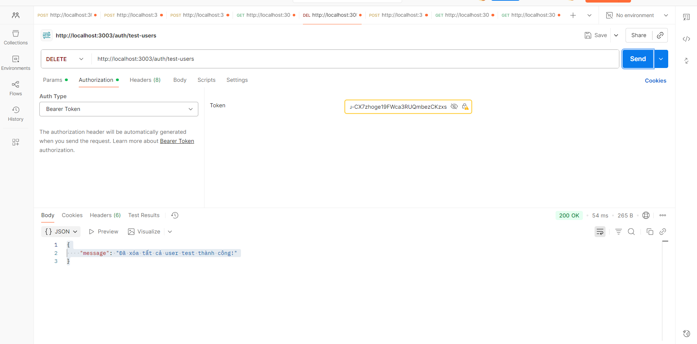

# 22716921-NgoNguyenCamVi-EProject
### tạo file docker-compose.yml

### tạo file dockerfile

### Đăng ký

### Đăng ký trùng

### data được lưu trên mongo

### Đăng nhập

### profile

### dashboard

### delete test-user

### thêm product

### xem product trên mongo

### xem danh sách product

### mua hàng

### xem dữ liệu trên mongo

### trên rabbitMQ

